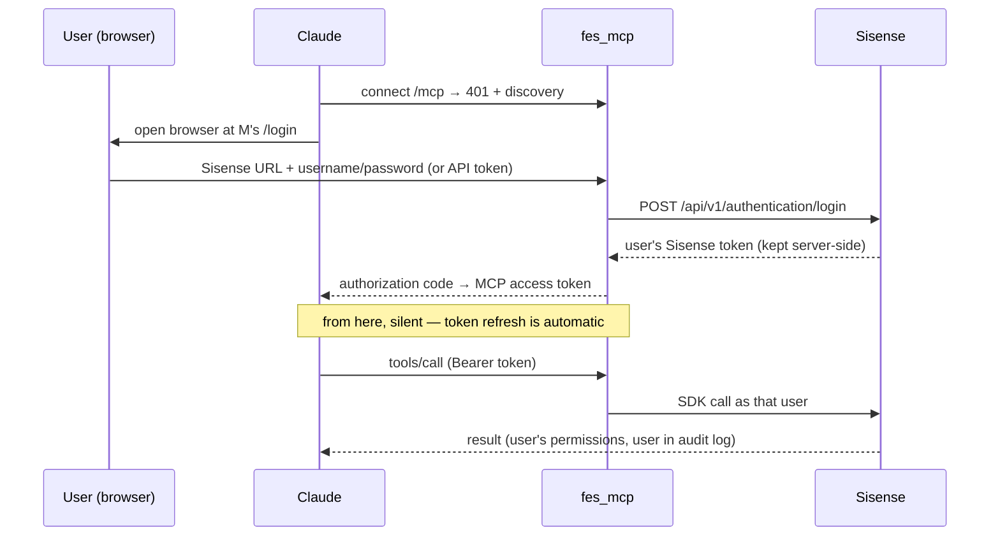

# fes_mcp — Sisense Admin MCP Server

A standalone, standards-conformant [MCP](https://modelcontextprotocol.io) server
exposing Sisense administration tools backed by the
[PySisense](https://pypi.org/project/pysisense/) SDK.

**Tools only, no agent.** Claude Desktop, Claude Code, claude.ai, Cursor — any
MCP client brings its own agent; this server advertises and executes ~100
curated Sisense admin tools (dashboards, data models, users/groups, folders,
plugins, health checks, …).

Two ways to run it:

| Mode | Auth | Sisense identity | Use case |
|---|---|---|---|
| **Local / dev** | none | one API token from env | your own machine, stdio or localhost HTTP |
| **OAuth 2.1** | browser sign-in per user | **every call runs as the signed-in user** | hosted server shared by a team |

## Architecture

```mermaid
flowchart LR
    subgraph clients [MCP clients]
        C1[Claude Desktop]
        C2[Claude Code]
        C3[claude.ai / Cursor]
    end

    subgraph server [fes_mcp]
        A[OAuth 2.1 provider\n+ /login page] --> S[(session store\nMCP token → Sisense credential)]
        T[Tool layer\nregistry-driven, 100+ tools] --> D[Dispatcher\nper-user PySisense client]
    end

    R[(tool registry JSON\nauto-generated from SDK)] -.defines.-> T

    C1 & C2 & C3 -- "streamable HTTP + Bearer token" --> T
    C1 & C2 & C3 -. "browser: sign in once" .-> A
    D -- "REST, as the signed-in user" --> F[Sisense instance(s)]
```

### OAuth flow (what a user experiences)



The client never sees Sisense credentials; the server never stores passwords
(used once to mint the user's token, then discarded). Users on SSO/MFA
instances sign in by pasting their personal Sisense API token instead.

### Layout

- `src/fes_mcp/` — `settings` (env config) · `registry` (load/filter) ·
  `dispatcher` (per-credential SDK dispatch) · `auth` (OAuth provider +
  login page) · `middleware` (access logs) · `server` (FastMCP assembly)
- `config/tools.registry.with_examples.json` — auto-generated tool registry.
  **Never handwritten**; regenerate with `./refresh_registry.sh` when
  PySisense updates.
- `config/allowlist.txt` — the curated tool surface, one tool per line.
  Delete/comment a line to remove a tool. Tools not listed are never exposed,
  so registry refreshes can't silently widen the surface.
- Mutating tools are gated behind `FES_MCP_ALLOW_MUTATIONS=true` — see
  [Security](#security) for the full mutation safeguards.

## Quick start (local dev)

Requires Python 3.11+ and [uv](https://docs.astral.sh/uv/).

```bash
uv sync
cp .env.example .env   # set SISENSE_DOMAIN / SISENSE_TOKEN
uv run fes-mcp         # stdio transport
```

Claude Desktop (`claude_desktop_config.json`):

```json
{
  "mcpServers": {
    "sisense-admin": {
      "command": "uv",
      "args": ["run", "--directory", "/absolute/path/to/fes_mcp", "fes-mcp"]
    }
  }
}
```

## OAuth mode (hosted, per-user)

```bash
FES_MCP_AUTH=oauth FES_MCP_TRANSPORT=http FES_MCP_PUBLIC_URL=https://your-host uv run fes-mcp
```

Users add `https://your-host/mcp` as a custom connector in their MCP client
and sign in through the browser page the client opens. No Sisense credentials
are configured on the server in this mode.

Endpoints: `/mcp` (MCP), `/login` (sign-in page, reached via the OAuth flow
only), `/.well-known/*` + `/authorize` + `/token` + `/register` (OAuth 2.1),
`/` (status), `/healthz` (health probe).

Sessions are in-memory in v1 — a server restart requires users to sign in
again. Hardening details are covered in [Security](#security).

## Security

### Credential handling

The MCP client never sees Sisense credentials, and the server never stores
passwords — a password is used once against Sisense's login API to mint the
user's own token, then discarded. Sisense tokens live server-side, keyed to
the MCP access token, and survive refresh rotation. In dev mode the single
env credential (`SISENSE_DOMAIN`/`SISENSE_TOKEN`) stays on your machine.

Hardening on the hosted surface: per-IP login rate limiting, CSRF-protected
login form, access logs with request ids, and per-call tool logs
(tool / user domain / outcome / duration).

### Authorization

Nothing custom: authorization is Sisense's job. Every tool call runs with the
signed-in user's own Sisense token, so Sisense enforces their real permissions
on every API call and permission errors surface to the client verbatim.

### Mutations

Mutating tools are exposed only when `FES_MCP_ALLOW_MUTATIONS=true`, always
carry `destructiveHint`, are blocked server-side as a second layer when
disabled, and are written to a mutation audit log.

On top of that, mutating tools ask the human for approval before executing —
via MCP elicitation, on clients that declare the capability (Claude Code,
Cursor, VS Code). A proceed/abort dialog opens mid-call; abort or decline
changes nothing. On clients without elicitation (Claude Desktop, claude.ai)
the call proceeds normally and the client's own tool-approval flow plus the
`destructiveHint` annotation are the safeguard, as for any MCP server.

Proceeding without the dialog is a deliberate decision (fail-open), not an
oversight: elicitation is an optional client capability and can be
auto-answered by a misbehaving client, so it is treated strictly as UX — the
authorization boundary is always the user's own Sisense permissions.

### Data flow to the LLM provider

This server has no summarization or data-redaction layer: every tool result —
full rows, not `{ok, count}` metadata — is returned to the MCP client and
lands in the model's context. That is by design and is what makes multi-step
tool chaining work: the model can only reason over, filter, and feed one
tool's output into the next call if it actually sees the data.

The consequence: whoever connects this server to an MCP client is accepting
that Sisense data (dashboard contents, query results, user lists, …) flows to
that client's LLM provider — e.g. Anthropic, for Claude — under **their own
terms with that provider**. The server cannot enforce or scope this; it is a
per-deployment acceptance to make consciously. Ways to narrow the exposure:
curate `config/allowlist.txt` down to the tools a deployment actually needs,
and keep `FES_MCP_ALLOW_MUTATIONS=false` unless writes are required.

## Configuration

| Variable | Default | Purpose |
|---|---|---|
| `SISENSE_DOMAIN` / `SISENSE_TOKEN` | — | dev-mode credential (ignored per-user in oauth mode) |
| `SISENSE_SSL_VERIFY` | `true` | verify TLS when calling Sisense (dev mode) |
| `FES_MCP_AUTH` | `none` | `none` (dev) or `oauth` |
| `FES_MCP_PUBLIC_URL` | — | public base URL (oauth mode) |
| `FES_MCP_TRANSPORT` | `stdio` | `stdio` or `http` |
| `FES_MCP_HOST` / `FES_MCP_PORT` | `127.0.0.1` / `8200` | HTTP bind |
| `FES_MCP_TOOLS` | `config/allowlist.txt` | comma-separated tool_ids / modules override |
| `FES_MCP_ALLOW_MUTATIONS` | `false` | expose mutating tools |
| `FES_MCP_REGISTRY_PATH` | bundled registry | alternate registry JSON |
| `FES_MCP_LOG_LEVEL` | `INFO` | log verbosity (stderr only) |

## Tests

```bash
uv run python -m pytest
```

(`python -m` matters: it puts the repo root on `sys.path`, which the test
modules' `from tests.conftest import …` imports rely on.)

37 tests, no network and no credentials needed (the SDK is mocked): registry
selection, dispatcher validation/errors, MCP round-trips, mutation
confirmation (approve/abort/decline/no-capability), and the complete
headless OAuth dance — client registration → authorize → login → PKCE code
exchange → authenticated call → refresh rotation — plus the abuse paths
(forged CSRF, brute-force rate limit, expired sessions).

## Registry regeneration

```bash
./refresh_registry.sh   # rebuild config/ from the installed PySisense SDK
```

New SDK methods land in the registry but stay **hidden** until explicitly
added to `config/allowlist.txt`.

## Out of scope (v1)

- Migration tools (dual-tenant — needs its own connection mode)
- Persistent session store / multi-replica (in-memory is v1)
- Any agent loop — bring your own MCP client
