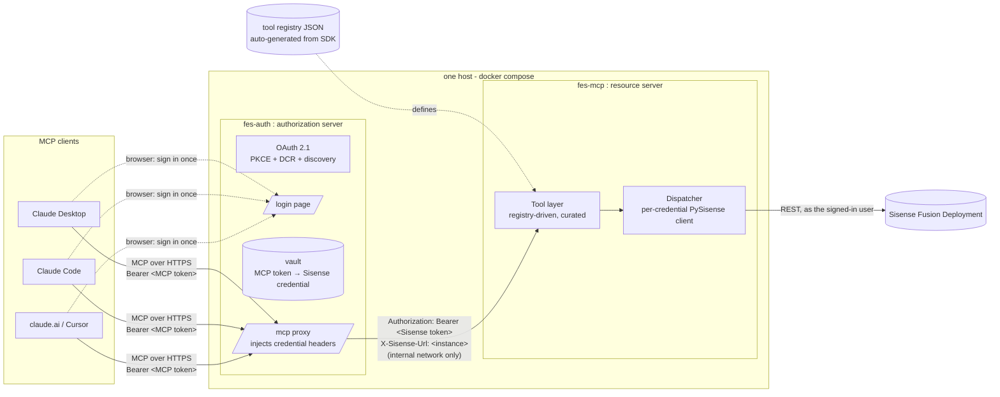
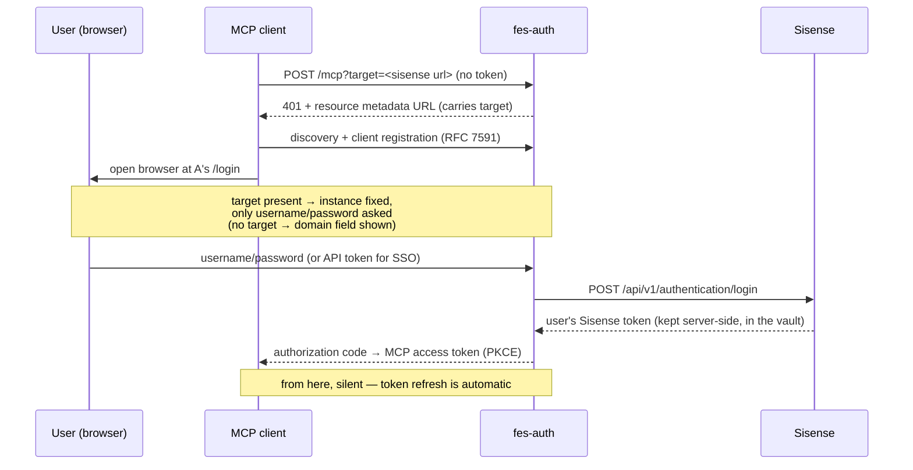
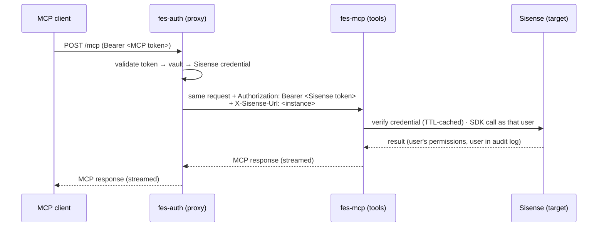

# Sisense Meta-Management MCP Server

> ⚠️ **Experimental Project Notice**
>
> **Community-Contributed Tool from Sisense Field Engineering**
>
> This project is an experimental tool developed by Sisense Field Engineering
> to facilitate customer learning and exploration of Sisense capabilities.
> It is **not part of the core Sisense product release lifecycle** and does
> not undergo the same validation, support, or certification processes as
> generally available (GA) Sisense features. It is provided **"as-is"** —
> see [Support and contributing](#support-and-contributing).

A standards-conformant [MCP](https://modelcontextprotocol.io) server that
exposes **Sisense environment operations as AI-ready tools**, backed by the
[PySisense](https://pypi.org/project/pysisense/) SDK: governance, asset and
user/group management, lifecycle tasks, and well-checks — **not**
chart-building or analytics Q&A.

It works for **any Sisense user**: every tool call runs with the calling
user's own Sisense credential, so results and permissions are exactly what
that user can see and do in Sisense itself, enforced natively by Sisense's
APIs.

**Tools only, no agent.** Claude Desktop, Claude Code, claude.ai, Cursor — any
MCP client brings its own agent; this project advertises and executes a
**curated subset of the ~170 SDK methods in the registry** (dashboards, data
models, users/groups, folders, plugins, queries, …) — one tool per
capability, with near-duplicates excluded so an agent never has to
choose between near-identical methods.

## Architecture

The MCP spec's modern shape, as two cooperating services shipped as two
Docker images (`fes-auth`, `fes-mcp` — built from one multi-stage Dockerfile
with shared layers):

- **fes-auth** — the *authorization server* (AS). Owns everything about *who
  is calling*: OAuth 2.1 for MCP clients (PKCE, dynamic client registration,
  discovery), the browser sign-in page, and the credential vault mapping each
  issued MCP token to the user's Sisense token. It proxies every tool call to
  the resource server with the Sisense credential injected.
- **fes-mcp** — the *resource server* (RS). Stateless, OAuth-unaware. Reads
  the injected credential from each request, verifies it against Sisense
  (cached), and runs the tool as that user against that Sisense instance.



The seam between the two services is just those two headers plus the 401
contract, so each half can evolve — or be replaced — without the other
noticing. There is **no shared secret** between the two; trust is the
internal network (the RS's port is never published).

### Sign-in flow (what a user experiences)

Each user adds the connector once in their MCP client, naming their own
Sisense instance in the URL:

```
https://your-host/mcp?target=https://acme.sisense.com
```



The client never sees Sisense credentials; the server never stores passwords
(used once to mint the user's token, then discarded). Users on SSO/MFA
instances sign in by pasting their personal Sisense API token instead.

### Tool call (steady state)



### Credential lifecycle and self-healing

- The resource server re-verifies each (instance, token) pair against Sisense
  after `FES_MCP_VERIFY_TTL` seconds (default 300). A token revoked in
  Sisense turns into an HTTP **401** within at most that window.
- fes-auth treats an RS 401 as *credential dead*: it deletes the vault entry
  and re-challenges the MCP client, whose next move is to re-run the sign-in
  flow. Server-side revocation therefore propagates with no manual steps.
- **Sessions are in-memory** (no database): restarting fes-auth
  signs everyone out — each user's next call pops the browser login again
  (with `?target=` set, that's just username/password). Restarting fes-mcp is
  invisible: it holds no state.

## Deployment (docker compose)

```bash
docker compose up --build
```

This builds the two images (`docker build --target fes-auth|fes-mcp`) and
publishes only fes-auth on `:8200`; fes-mcp stays internal. Terminate TLS in
front (ALB / nginx / Caddy) — MCP clients require HTTPS for OAuth — and set
`FES_MCP_PUBLIC_URL` to that public URL:

```bash
FES_MCP_PUBLIC_URL=https://your-host.example.com docker compose up -d --build
```

Users then add `https://your-host.example.com/mcp?target=https://their-instance.sisense.com`
as a custom connector. The `?target=` part is optional — without it the login
page asks for the Sisense URL as a third field.

Endpoints on fes-auth: `/mcp` (proxied MCP), `/login`, `/.well-known/*` +
`/authorize` + `/token` + `/register` (OAuth 2.1), `/` (status), `/healthz`.
Hardening included: per-IP login rate limiting, CSRF-protected login form,
access logs with request ids.

OAuth discovery requires the server's paths at the **origin root**, so give
it its own hostname — or, on a shared hostname, route exactly these paths to
fes-auth at the proxy. A path prefix (`https://host/some-prefix/mcp`) will
not work.

## Quick start (local dev)

Requires Python 3.11+ and [uv](https://docs.astral.sh/uv/). Local dev skips
the AS entirely: stdio transport defaults to `env` auth — one credential from
`.env`, everything runs as you.

```bash
uv sync
cp .env.example .env   # set SISENSE_DOMAIN / SISENSE_TOKEN
uv run fes-mcp         # stdio transport
```

MCP client config (e.g. `claude_desktop_config.json`):

```json
{
  "mcpServers": {
    "sisense": {
      "command": "uv",
      "args": ["run", "--directory", "/absolute/path/to/fes_mcp", "fes-mcp"]
    }
  }
}
```

To run the full split locally without Docker:

```bash
FES_MCP_TRANSPORT=http uv run fes-mcp &                 # RS on :8200 (upstream auth)
FES_MCP_PORT=8300 FES_MCP_RS_URL=http://127.0.0.1:8200 uv run fes-auth
# connector: http://127.0.0.1:8300/mcp?target=https://your.sisense.com
```

## Layout

- `src/fes_mcp/` — `settings` (env config) · `registry` (load/filter) ·
  `schema_patches` (field-description overlay) · `dispatcher`
  (per-credential SDK dispatch) · `upstream` (RS credential verification) ·
  `auth` (OAuth provider + login page) · `authserver` (fes-auth service +
  proxy) · `middleware` (access logs) · `server` (FastMCP assembly)
- `config/tools.registry.with_examples.json` — auto-generated tool registry.
  **Never handwritten**; regenerate with `./refresh_registry.sh` when
  PySisense updates.
- `config/allowlist.txt` — the curated tool surface, one tool per line.
  Delete/comment a line to remove a tool. Tools not listed are never exposed,
  so registry refreshes can't silently widen the surface. (Migration tools
  are not listed — they need a dual-instance connection this
  server doesn't model.)
- Mutating tools are gated behind `FES_MCP_ALLOW_MUTATIONS=true` — see
  [Security](#technical-and-security-considerations) for the full mutation
  safeguards.
- Payload parameters carry full nested schemas straight from the SDK's
  TypedDict contracts (pysisense ≥ 1.1.0) — e.g. `create_user`'s `user_data`
  declares `email` and `role` as required, so an agent gathers them *before*
  calling instead of failing inside the SDK. `schema_patches.py` overlays
  only human-written per-field descriptions (the contracts carry structure,
  not prose); free-form payloads like JAQL stay unconstrained.

## Technical and security considerations

### Credential handling

The MCP client never sees Sisense credentials, and the server never stores
passwords — a password is used once against Sisense's login API to mint the
user's own token, then discarded. Sisense tokens live in fes-auth's in-memory
vault, keyed to the MCP access token, and survive refresh rotation. In dev
mode the single env credential (`SISENSE_DOMAIN`/`SISENSE_TOKEN`) stays on
your machine. Nothing is persisted to disk — there is no database and no
encryption-at-rest surface; a fes-auth restart clears the vault and users
sign in again.

Hardening on the hosted surface: per-IP login rate limiting, CSRF-protected
login form, access logs with request ids, and per-call tool logs
(tool / user domain / outcome / duration).

### Authorization

Nothing custom: authorization is Sisense's job. Every tool call runs with the
calling user's own Sisense token, so Sisense enforces their real permissions
on every API call and permission errors surface to the client verbatim. This
is also why the server is **not** admin-only — any Sisense user gets exactly
their own scope.

### Trust between the two services

fes-auth ↔ fes-mcp trust is network-level: no shared secret. The RS's port
must never be reachable from outside the internal network (compose publishes
only fes-auth). Defense in depth: `FES_MCP_ALLOWED_SISENSE_ORIGINS` pins
which Sisense origins the RS will accept in `X-Sisense-Url`.

### Mutations

Mutating tools are exposed only when `FES_MCP_ALLOW_MUTATIONS=true`, always
carry `destructiveHint`, are blocked server-side as a second layer when
disabled, and are written to a mutation audit log.

On top of that, mutating tools ask the human for approval before executing.
The confirmation shows the exact arguments about to run (secrets masked), the
approval is bound to those arguments, and abort or decline changes nothing.
It works on both protocol generations: current (stateless) connections use an
MCP `input_required` round trip, older connections use MCP elicitation.

A client that cannot render the confirmation proceeds under its own
tool-approval flow plus the `destructiveHint` annotation, like any standard
MCP server — the authorization boundary is always the user's own Sisense
permissions.

### Data flow to the LLM provider

This server has no summarization or data-redaction layer: every tool result —
full rows, not `{ok, count}` metadata — is returned to the MCP client and
lands in the model's context. This is what makes multi-step
tool chaining work: the model can only reason over, filter, and feed one
tool's output into the next call if it actually sees the data.

The consequence: whoever connects this server to an MCP client is accepting
that Sisense data (dashboard contents, query results, user lists, …) flows to
that client's LLM provider — e.g. Anthropic, for Claude — under **their own
terms with that provider**. The server cannot enforce or scope this; it is a
per-deployment acceptance to make consciously.

## Recommended usage guidelines

- Start read-only: keep `FES_MCP_ALLOW_MUTATIONS=false` (the default) until
  you've built confidence in a non-production environment.
- Curate `config/allowlist.txt` down to the tools your deployment actually
  needs — fewer tools means less data exposure and a clearer approval story.
- Prefer non-production Sisense instances while exploring; the tools are
  only as safe as the signed-in user's permissions.
- Test destructive operations in a non-production environment first; the
  server asks for confirmation with the exact arguments before any write.

## Configuration

| Variable | Default | Used by | Purpose |
|---|---|---|---|
| `SISENSE_DOMAIN` / `SISENSE_TOKEN` | — | fes-mcp | dev-mode (`env`) credential |
| `SISENSE_SSL_VERIFY` | `true` | both | verify TLS when calling Sisense |
| `FES_MCP_AUTH` | by transport: http ⇒ `upstream`, stdio ⇒ `env` | fes-mcp | credential source |
| `FES_MCP_TRANSPORT` | `stdio` | fes-mcp | `stdio` or `http` |
| `FES_MCP_HOST` / `FES_MCP_PORT` | `127.0.0.1` / `8200` | both | HTTP bind |
| `FES_MCP_PUBLIC_URL` | — | fes-auth | public base URL (OAuth discovery/redirects) |
| `FES_MCP_RS_URL` | — | fes-auth | the resource server to proxy tool calls to |
| `FES_MCP_VERIFY_TTL` | `300` | fes-mcp | seconds a verified (instance, token) pair is trusted |
| `FES_MCP_ALLOWED_SISENSE_ORIGINS` | — (accept any) | fes-mcp | exact-match allowlist for `X-Sisense-Url` |
| `FES_MCP_TOOLS` | `config/allowlist.txt` | fes-mcp | comma-separated tool_ids / modules override |
| `FES_MCP_ALLOW_MUTATIONS` | `false` | fes-mcp | expose mutating tools |
| `FES_MCP_REGISTRY_PATH` | bundled registry | fes-mcp | alternate registry JSON |
| `FES_MCP_LOG_LEVEL` | `INFO` | both | log verbosity (stderr only) |

## Tests

```bash
uv run python -m pytest              # unit tests: mocked, no credentials
```

Integration tests run against a real Sisense instance and are read-only; see
[tests/integration/README.md](tests/integration/README.md) for setup:

```bash
uv run python -m pytest tests/integration -m integration
```

## Registry regeneration

```bash
./refresh_registry.sh   # rebuild config/ from the installed PySisense SDK
```

New SDK methods land in the registry but stay **hidden** until explicitly
added to `config/allowlist.txt`.

## Support and contributing

This is an experimental, community-contributed project maintained by Sisense
Field Engineering and provided **"as-is."**

- **Do not open a GSS ticket** — this is not a GA Sisense feature.
- For usage questions or help getting started, contact your Customer Success
  Manager (CSM), who will route feedback to the Field Engineering team.
- Issues and contributions are welcome through the repository.

## License

[MIT](LICENSE)
